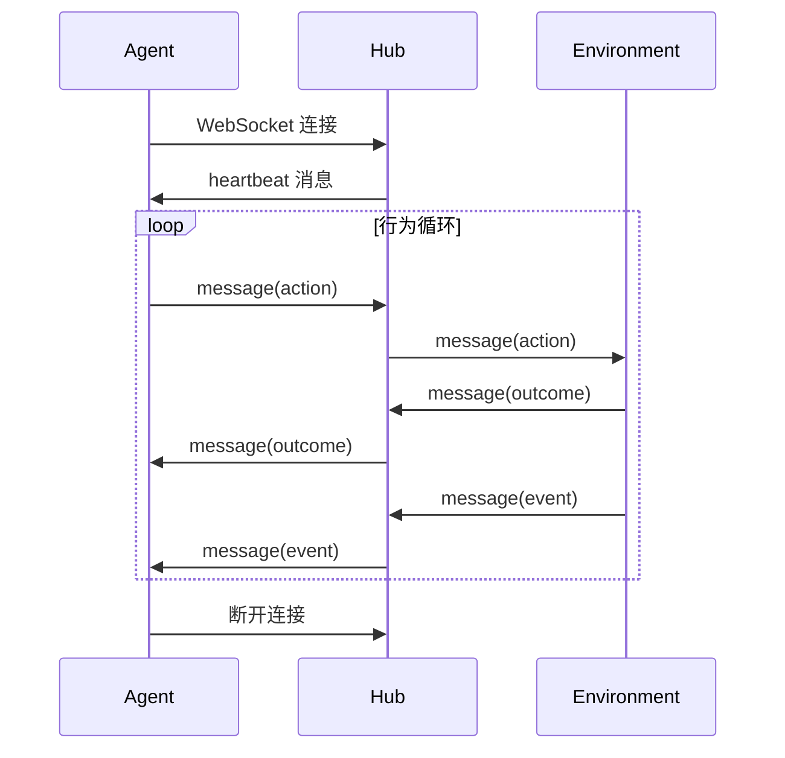
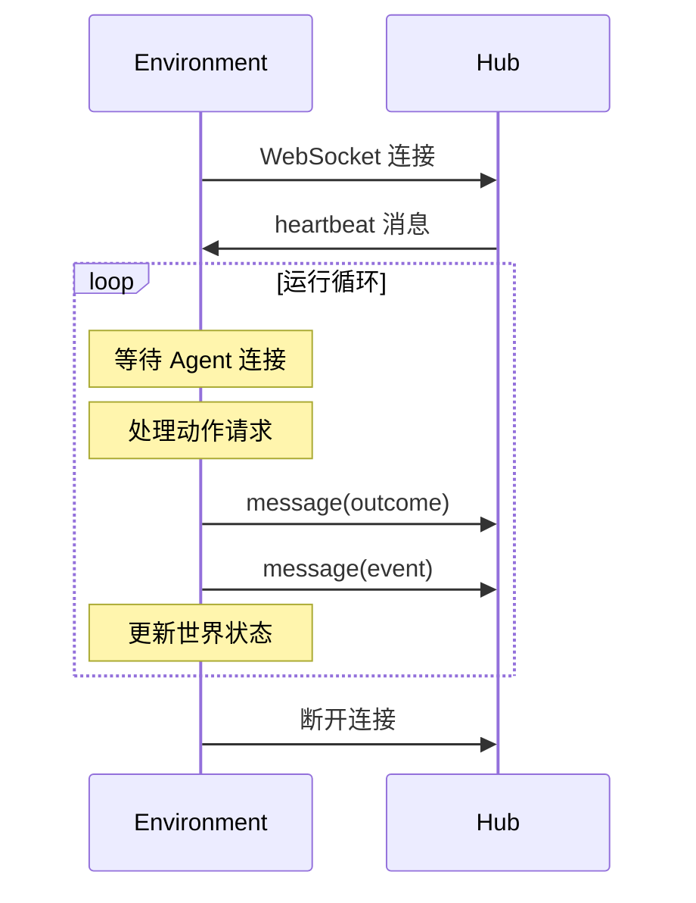
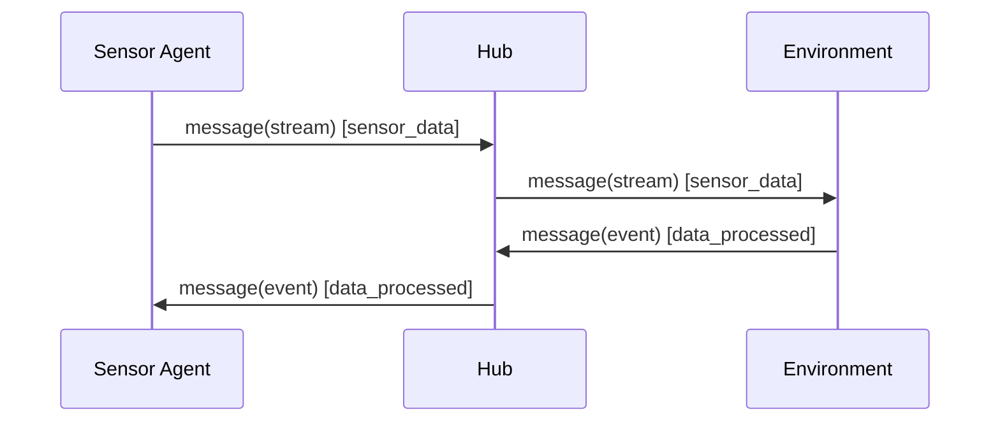

# Star Protocol 协议规范文档

**版本**: 1.0  
**日期**: 2025年8月19日  
**状态**: 正式版

## 目录

1. [协议概述](#协议概述)
2. [架构设计](#架构设计)
3. [连接规范](#连接规范)
4. [消息格式](#消息格式)
5. [客户端类型](#客户端类型)
6. [消息类型定义](#消息类型定义)
7. [事件流程](#事件流程)
8. [错误处理](#错误处理)
9. [认证授权](#认证授权)
10. [扩展机制](#扩展机制)

---

## 协议概述

Star Protocol 是一个基于 WebSocket 的多智能体协作通信协议，支持 Agent、Environment、Human 和 Hub 之间的实时消息传递和协作。

### 设计原则

- **分层架构**: Hub-Client 架构，中央路由器模式
- **类型安全**: 强类型消息格式和验证
- **实时通信**: 基于 WebSocket 的双向通信
- **可扩展性**: 支持自定义消息类型和客户端类型
- **监控集成**: 内置监控和状态管理
- **业务分离**: 客户端只负责消息传输，业务逻辑在上层

---

## 架构设计

### 整体架构

```
┌─────────────────┐    ┌─────────────────┐    ┌─────────────────┐
│   Agent Client  │    │   Hub Server    │    │Environment Client│
│                 │◄──►│                 │◄──►│                 │
│  消息传输层       │    │  路由 + 验证     │    │  消息传输层       │
└─────────────────┘    └─────────────────┘    └─────────────────┘
         ▲                       ▲                       ▲
         │                       │                       │
┌─────────────────┐              │              ┌─────────────────┐
│ 业务逻辑层        │              │              │ 业务逻辑层       │
│ (IntelligentAgent)│            │              │ (SimpleWorld)   │
└─────────────────┘              │              └─────────────────┘
                                 ▼
                       ┌─────────────────┐
                       │   Human Client  │
                       │                 │
                       │  消息传输层       │
                       └─────────────────┘
                                  ▲
                                  │
                       ┌─────────────────┐
                       │ 业务逻辑层        │
                       │ (UserInterface) │
                       └─────────────────┘
```

### 层次职责

#### Hub Server
- **消息路由**: 根据接收者信息转发消息
- **连接管理**: 管理所有客户端连接
- **消息验证**: 验证消息格式和权限
- **状态监控**: 实时监控系统状态
- **认证授权**: 可选的身份验证

#### Client Layer (消息传输层)
- **连接管理**: WebSocket 连接的建立和维护
- **消息序列化**: JSON 消息的编码和解码
- **事件分发**: 将收到的消息分发给处理器
- **监控集成**: 自动记录连接状态和消息统计

#### Business Logic Layer (业务逻辑层)
- **智能行为**: Agent 的决策和行为逻辑
- **环境模拟**: 虚拟世界的状态管理
- **用户交互**: 人类用户的界面和交互
- **状态管理**: 应用级别的状态维护

---

## 连接规范

### WebSocket 端点

#### Hub Server 端点
```
以 Server 方式启动
```

#### 客户端连接端点

##### Agent 连接
```
ws://host:port/env/{env_id}/agent/{agent_id}
```

**参数说明**:
- `env_id`: 环境标识符 (字符串, 3-50字符)
- `agent_id`: Agent 标识符 (字符串, 3-50字符)

##### Environment 连接  
```
ws://host:port/env/{env_id}
```

**参数说明**:
- `env_id`: 环境标识符 (字符串, 3-50字符)

<!-- ##### Human 连接
```
ws://host:port/human/{human_id}
```

**参数说明**:
- `human_id`: 人类用户标识符 (字符串, 3-50字符) -->

### 连接流程

1. **启动Hub**
2. **启动环境**
3. **启动希望加入环境的agent**
4. **开始消息交换**

---

## 消息格式

Star Protocol 采用**两层协议设计**：

### 协议分层架构

```
┌─────────────────────────────────────────────────────────────┐
│                         Envelope                            │
│  负责消息路由、寻址、验证                                       │
│  ┌─────────────────────────────────────────────────────┐    │
│  │                      Message                        │    │
│  │  负责具体业务逻辑、动作处理、状态同步                     │    │
│  │                                                     │    │
│  └─────────────────────────────────────────────────────┘    │
└─────────────────────────────────────────────────────────────┘
```

### 外层协议 (路由层)

**职责**: 消息路由、客户端寻址、连接管理  
**作用范围**: 整个 Star Protocol 网络

#### 外层消息结构

```json
{
  "type": "消息类型",              // Envelope消息类型
  "sender": "发送者ID",
  "recipient": "接收者ID",
  "message": {                     // Message消息类型
    // 具体业务消息内容
  },
  "timestamp": "ISO8601时间戳",     // 可选: 消息时间戳
  "id": "消息唯一标识",              // 可选: 消息追踪ID
  "version": "1"
}
```

#### 外层消息类型

| 类型 | 用途 | 处理者 | 转发规则 |
|------|------|--------|----------|
| `heartbeat` | 心跳确认 | Hub | 发送给客户端 |
| `message` | 业务消息容器 | Hub | 根据 sender 和 recipient 转发 |

### 内层协议 (业务层)

**职责**: 具体业务逻辑处理、动作执行、状态同步  
**作用范围**: 客户端之间的业务交互

#### 内层消息结构 (payload 内容)

内层协议位于外层协议的 `payload` 字段中：

```json
{
  "type": "action｜outcome｜event｜stream",  // 业务消息类型
  // 具体业务字段...
}
```
#### 内层消息类型

| 类型 | 用途 | 处理者 | 转发规则 |
|------|------|--------|----------|
| `action` | 动作请求 | Client | 发送给客户端 |
| `outcome` | 动作结果 | Client | 发送给客户端 |
| `event` | 环境事件 | Client | 发送给客户端 |
| `stream` | 数据流 | Client | 发送给客户端 |

### 两层协议示例

#### 完整的 Agent 动作请求消息

```json
{
  // ═══════════════ 外层协议 (Hub 路由层) ═══════════════
  "type": "message",                    // Hub: 这是一个业务消息，需要转发
  "id": "msg_12345",
  "sender": {                           // Hub: 发送者是 agent_001
    "id": "agent_001", 
    "type": "agent"
  },
  "recipient": {                        // Hub: 接收者是 demo_world 环境
    "id": "demo_world", 
    "type": "environment"
  },
  "timestamp": "2025-08-19T10:30:00Z",
  
  
  // ═══════════════ 内层协议 (业务逻辑层) ═══════════════
  "payload": {                          // 业务层: 这是一个动作请求
    "type": "action",                   // 业务层: 动作类型消息
    "action": "move",                   // 业务层: 移动动作
    "id": "action_67890",               // 业务层: 动作唯一ID
    "parameters": {                     // 业务层: 动作参数
      "direction": "north",
      "distance": 2.5
    }
  }
}
```

#### Hub 路由处理流程

1. **Hub 接收消息**: 解析外层协议
2. **路由决策**: 根据 `recipient` 确定转发目标
3. **权限检查**: 验证 `sender` 是否有权限发送给 `recipient`
4. **消息转发**: 将完整消息转发给目标客户端
5. **目标处理**: 目标客户端解析 `payload` 中的业务逻辑

### 字段说明

#### 外层协议字段

**type** (路由层消息类型)
- `heartbeat`: 连接心跳
- `message`: 业务消息容器 (最常用)
- `error`: 错误信息

**sender/recipient** (路由信息)
```json
{
  "id": "string",      // 客户端唯一标识
  "type": "string"     // 客户端类型: "agent" | "environment" | "human" | "hub"
}
```

**payload** (内层协议载荷)
根据业务消息类型不同，包含不同的结构化数据。Hub 不解析此字段，直接透传。

#### 内层协议字段 (payload 内容)

**type** (业务层消息类型)
- `action`: 动作请求
- `outcome`: 动作结果  
- `event`: 环境事件
- `stream`: 数据流

**其他字段**: 根据具体业务类型包含不同字段

### 协议层次职责

#### Hub Server (外层协议处理者)
- 解析 `type`, `sender`, `recipient`
- 消息路由和转发
- 连接管理和权限验证
- **不处理** `payload` 内容
- **不关心** 具体业务逻辑

#### Client (内层协议处理者)
- ✅ 解析 `payload` 中的业务消息
- ✅ 执行具体业务逻辑
- ✅ 生成业务响应

---

## 客户端类型

### Agent (智能体)
**标识**: `"agent"`  
**职责**: 执行智能任务，与环境和其他 Agent 交互  
**连接**: 连接到特定环境

### Environment (环境)
**标识**: `"environment"`  
**职责**: 管理虚拟世界状态，处理 Agent 动作  
**连接**: 作为环境提供者

### Human (人类用户)
**标识**: `"human"`  
**职责**: 人类用户交互，观察或参与系统  
**连接**: 独立连接，与 Agent 或 Environment 互动

### Hub (中央服务器)
**标识**: `"hub"`  
**职责**: 消息路由，连接管理，系统监控  
**连接**: 服务器端，不作为客户端

---

## 消息类型定义

### 1. 外层协议消息 (Hub 路由层)

#### heartbeat - 心跳确认
**发送者**: Hub  
**接收者**: Client  
**用途**: 保持连接活跃，确认客户端状态
**Hub 处理**: 直接发送，无需路由

```json
{
  "type": "heartbeat",
  "sender": {"id": "hub", "type": "hub"},
  "recipient": {"id": "client_id", "type": "client_type"}, 
  "payload": {
    "timestamp": "2025-08-19T10:30:00Z",
    "server_status": "running",
    "ping": "pong"
  }
}
```

#### error - 系统错误
**发送者**: Hub  
**接收者**: Specific Client  
**用途**: Hub 报告系统级错误 (连接、路由、权限等)
**Hub 处理**: 直接发送，无需路由

```json
{
  "type": "error",
  "sender": {"id": "hub", "type": "hub"},
  "recipient": {"id": "client_id", "type": "client_type"},
  "payload": {
    "error_code": "VALIDATION_ERROR|CONNECTION_ERROR|PERMISSION_DENIED",
    "message": "人类可读的错误描述",
    "details": {
      "original_message_id": "引起错误的原始消息ID",
      "suggested_action": "建议的解决方案"
    }
  }
}
```

### 2. 业务消息容器 (message 类型)

这是最重要的消息类型，Hub 只负责路由，不处理 payload 内容。

#### message - 业务消息容器
**发送者**: Any Client  
**接收者**: Any Client  
**用途**: 承载所有业务逻辑消息
**Hub 处理**: 根据 sender 和 recipient 进行路由转发，不解析 payload

```json
{
  "type": "message",                        // 外层: Hub 识别为需要路由的消息
  "sender": {"id": "agent_001", "type": "agent"},
  "recipient": {"id": "demo_world", "type": "environment"},
  "payload": {
    // 内层协议: Hub 透传，不解析
    "type": "action",                       // 业务消息类型
    "action": "move",                       // 具体业务内容
    "id": "action_12345",                   
    "parameters": {
      "direction": "north",
      "distance": 2.5
    }
  }
}
```

### 3. 内层协议消息类型 (payload.type)

这些消息类型位于 message 的 payload 中，由客户端业务逻辑层处理。

#### action - 动作请求
**发送者**: Agent  
**接收者**: Environment  
**用途**: Agent 请求执行动作
**路由**: 通过 message 容器发送

```json
{
  "type": "message",
  "sender": {"id": "agent_001", "type": "agent"},
  "recipient": {"id": "demo_world", "type": "environment"},
  "payload": {
    "type": "action",                       // 内层: 动作请求
    "action": "move|observe|pickup|ping",   // 动作类型
    "id": "action_12345",                   // 动作唯一标识
    "parameters": {                         // 动作参数
      "direction": "north",
      "distance": 2.5
    }
  }
}
```


#### outcome - 动作结果
**发送者**: Environment  
**接收者**: Agent  
**用途**: 返回动作执行结果
**路由**: 通过 message 容器发送

```json
{
  "type": "message",
  "sender": {"id": "demo_world", "type": "environment"},
  "recipient": {"id": "agent_001", "type": "agent"},
  "payload": {
    "type": "outcome",                      // 内层: 动作结果
    "id": "action_12345",            // 对应的动作ID
    "outcome": {
      "status": "success|error",            // 执行状态
      "message": "移动成功",                // 结果描述
      "data": {                             // 具体结果数据
        "new_position": {"x": 5, "y": 10},
        "energy_cost": 2
      }
    },
    "outcome_type": "dict",                  // 动作类型
  }
}
```

#### event - 环境事件
**发送者**: Environment  
**接收者**: All/Specific  
**用途**: 广播环境变化事件
**路由**: 通过 message 容器发送 (可能广播)

```json
{
  "type": "message",
  "sender": {"id": "demo_world", "type": "environment"},
  "recipient": {"id": "*", "type": "agent"},  // 广播给所有 Agent
  "payload": {
    "type": "event",                        // 内层: 环境事件
    "id": "event_12345",                // 事件唯一标识
    "event": "agent_moved|item_spawned|world_update",
    "data": {
      "agent_id": "agent_001",
      "new_position": {"x": 5, "y": 10},
      "timestamp": "2025-08-19T10:30:00Z"
    }
  }
}
```

#### stream - 数据流
**发送者**: Any  
**接收者**: Any  
**用途**: 传输连续的数据流 (如实时状态、传感器数据等)
**路由**: 通过 message 容器发送

```json
{
  "type": "message",
  "sender": {"id": "sensor_001", "type": "agent"},
  "recipient": {"id": "demo_world", "type": "environment"},
  "payload": {
    "type": "stream",                       // 内层: 数据流
    "stream_type": "sensor_data|status_update|telemetry",
    "sequence": 12345,                      // 序列号
    "data": {
      "temperature": 25.5,
      "humidity": 60.2,
      "timestamp": "2025-08-19T10:30:00Z"
    }
  }
}
```

---

## 事件流程

### Agent 生命周期



### 环境生命周期



### 数据流传输



---
